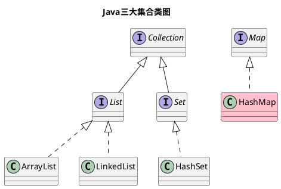
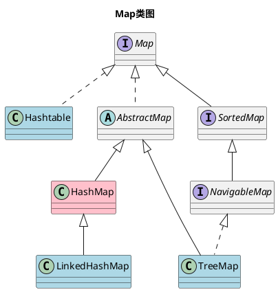

HashMap是Java中一种常见的集合实现，在不同的jdk版本中，HashMap的实现也不同。本文将以jdk8为主，从源码层面简单分析一下HashMap的存储结构与读写过程，最后简单介绍一下高并发下HashMap的使用方法。

<!--more-->

## 一、前言

Java有三种常见的集合：List、Set与Map，本文将介绍的HashMap是Map集合的一种实现，HashMap在集合中的位置如下所示：



`Map`有四个主要的实现，它们的关系如下所示：



> `Hashtable`是老版的`HashMap`，已不被建议使用;`LinkedHashMap`可以保证先写入的元素优先读取;`TreeMap`可以按照键进行排序。本文主要介绍`HashMap`，剩下的三个实现类不会涉及。

## 二、HashMap的存储结构

jdk7及以前版本中，`HashMap`的数据存储结构为`数组 + 链表`，该结构可以有效解决哈希冲突，通常将之称为`链地址法`。(也可以使用`开放定址法`解决哈希冲突，这种方法一般只使用数组结构)

jdk8及以后版本中，`HashMap`的数据存储结构为`数组 + 链表/红黑树`，出于性能考虑，jdk8的`HsahMap`新增了红黑树。在一定情况下链表与红黑树会相互转换(参见[下文](#三、HashMap的读写过程))。

> 当前jdk版本为18，后续版本如有变更，请以实际版本为准。

接下来看一看`HashMap`存储结构的源码定义。

1. 数组

```java
transient Node<K,V>[] table;
```

table定义是`HashMap`存储结构的关键，它是一个以`Node`为元素的数组，其中`Node`元素可以是一个链表节点，也可以是一个红黑树节点(TreeNode)。

2. 链表节点

```java
static class Node<K,V> implements Map.Entry<K,V> {
    final int hash;
    final K key;
    V value;
    Node<K,V> next;
}
```

链表节点`Node`是一个单向的链表，它的`next`属性指向下一个`Node`元素。

3. 红黑树节点

```java
static final class TreeNode<K,V> extends LinkedHashMap.Entry<K,V> {
    TreeNode<K,V> parent;  // red-black tree links
    TreeNode<K,V> left;
    TreeNode<K,V> right;
    TreeNode<K,V> prev;    // needed to unlink next upon deletion
    boolean red;
}
```

红黑树节点`TreeNode`在`Node`的基础上增加了红黑树的相关属性:父节点、左右孩子节点等等。

## 三、HashMap的读写过程

`HashMap`的`put`和`get`方法可以实现元素的读写。

### （一）HashMap的写操作过程

`HashMap`的`put`方法的源码如下所示：

```java
public V put(K key, V value) {
    return putVal(hash(key), key, value, false, true);
}

final V putVal(int hash, K key, V value, boolean onlyIfAbsent,
               boolean evict) {
    Node<K,V>[] tab; Node<K,V> p; int n, i;
    if ((tab = table) == null || (n = tab.length) == 0)
        n = (tab = resize()).length;
    if ((p = tab[i = (n - 1) & hash]) == null)
        tab[i] = newNode(hash, key, value, null);
    else {
        Node<K,V> e; K k;
        if (p.hash == hash &&
            ((k = p.key) == key || (key != null && key.equals(k))))
            e = p;
        else if (p instanceof TreeNode)
            e = ((TreeNode<K,V>)p).putTreeVal(this, tab, hash, key, value);
        else {
            for (int binCount = 0; ; ++binCount) {
                if ((e = p.next) == null) {
                    p.next = newNode(hash, key, value, null);
                    if (binCount >= TREEIFY_THRESHOLD - 1) // -1 for 1st
                        treeifyBin(tab, hash);
                    break;
                }
                if (e.hash == hash &&
                    ((k = e.key) == key || (key != null && key.equals(k))))
                    break;
                p = e;
            }
        }
        if (e != null) { // existing mapping for key
            V oldValue = e.value;
            if (!onlyIfAbsent || oldValue == null)
                e.value = value;
            afterNodeAccess(e);
            return oldValue;
        }
    }
    ++modCount;
    if (++size > threshold)
        resize();
    afterNodeInsertion(evict);
    return null;
}
```

根据上述源码，`HashMap`的写过程主要会执行以下操作：
- 初始化table空间
- 如果数组没有发生hash冲突时：直接将新节点放入数组中
- 如果数组发生hash冲突时：
    - 如果待存放的节点与冲突节点一样：直接返回冲突节点
    - 如果待存放的节点是`TreeNode`类型：进行红黑树插入操作
    - 否则：进行链表插入操作，并按需执行红黑树转化
- 后续处理

红黑树转化的转换条件如下所示：

```java
if (binCount >= TREEIFY_THRESHOLD - 1) 
    treeifyBin(tab, hash);
```

当链表节点数超过`TREEIFY_THRESHOLD`(默认为8)时，执行`treeify`操作，将链表转换成红黑树。该过程一般发生在`put`等方法中。

同时，当红黑树节点数低于`UNTREEIFY_THRESHOLD`(默认为6)时，执行`untreeify`操作，将红黑树退化成链表。该过程一般发生`remove`或`resize`等方法时。

### （二）HashMap的读操作过程

`HashMap`的`get`方法的源码如下所示：

```java
public V get(Object key) {
    Node<K,V> e;
    return (e = getNode(hash(key), key)) == null ? null : e.value;
}

final Node<K,V> getNode(int hash, Object key) {
    Node<K,V>[] tab; Node<K,V> first, e; int n; K k;
    if ((tab = table) != null && (n = tab.length) > 0 &&
        (first = tab[(n - 1) & hash]) != null) {
        if (first.hash == hash && // always check first node
            ((k = first.key) == key || (key != null && key.equals(k))))
            return first;
        if ((e = first.next) != null) {
            if (first instanceof TreeNode)
                return ((TreeNode<K,V>)first).getTreeNode(hash, key);
            do {
                if (e.hash == hash &&
                    ((k = e.key) == key || (key != null && key.equals(k))))
                    return e;
            } while ((e = e.next) != null);
        }
    }
    return null;
}
```

可以看到，`HashMap`的读操作的寻址链路，和写操作基本一致，这里就不再赘述了。

## 四、高并发下的HashMap

HashMap不是线程安全的，这意味着，高并发下多个线程同时读写同一个HashMap时，会产生数据不一致的问题。有以下了两种方式可以避免这种情况：

1. 使用SynchronizedMap类(通过Collections的synchronizedMap方法构造)
2. 使用ConcurrentHashMap类

> 手动加锁与HashTable也可以实现类似功能，但不太建议使用。

下面将简单介绍一下上述两种方法的使用。

### （一）使用SynchronizedMap类支持HashMap的高并发

如果想复用已有的HashMap对象，可以使用`Collections.synchronizedMap(Map m)`方法将其包裹起来即可，如下所示：

```java
Map synchronizedMap = Collections.synchronizedMap(new HashMap());
```

`synchronizedMap`方法会返回一个`SynchronizedMap`实例，`SynchronizedMap`的所有方法都是用`synchronized`进行了修饰，以`get`方法为例：

```java
public V get(Object key) {
    synchronized (mutex) {return m.get(key);} // mutex表示传入的HashMap实例
}
```

### （二）使用ConcurrentHashMap类支持HashMap的高并发

与`synchronizedMap`相比，`ConcurrentHashMap`有更高的性能。`ConcurrentHashMap`的实例化过程如下所示：

```java
Map concurrentMap = new ConcurrentHashMap<>();
```

`ConcurrentHashMap`的实现方法在jdk7与jdk8中也有较大差异，此处暂不做展开说明。


## 五、总结

本文主要介绍了以下几个点：
- `HashMap`是Java三大集合`Map`的一种实现，`Map`的四个实现分别是`HashMap`、`Hashtable`、`LinkedHashMap`及`TreeMap`。
- `HashMap`的存储结构为`数组 + 链表/红黑树`，链表和红黑树在一定情况下可以相互转换(适用于jdk8)。
- `HashMap`的读写顺序分别是:`数组 -> 红黑树 -> 链表`。
- `HashMap`的高并发场景下，可以使用`SynchronizedMap`与`ConcurrentHashMap`类。

有关`HashMap`更详细的内容暂时没有涉及，如hash索引生成方式、链表与红黑树转化`treeify`与`untreeify`的实现方式、红黑树的细节等等，后续将按需探讨。

> 参考文档

1. [HashMap (Java Platform SE 8 )](https://docs.oracle.com/javase/8/docs/api/java/util/HashMap.html)
2. [Java 8系列之重新认识HashMap](https://zhuanlan.zhihu.com/p/21673805)