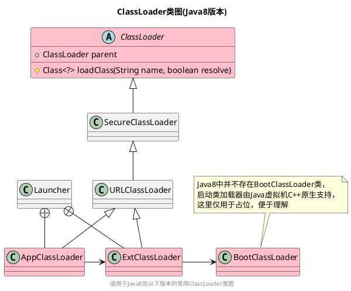
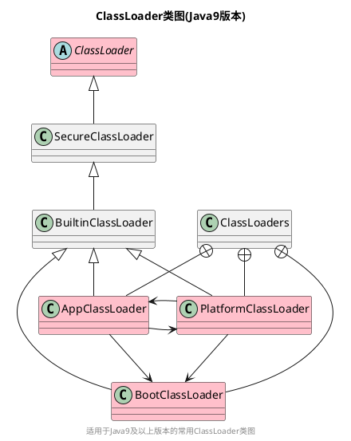

**双亲委派**(Parents Delegation)，一言以蔽之，就是：在Java虚拟机中，将类的加载行为**委派**给父级(**双亲**)类加载器的过程。

接下来将逐一介绍Java8及Java9中的类加载器，并根据类加载器的组织结构，描述双亲委派的实现过程。

<!--more-->

## 一、概念范围

首先，明确一下“双亲委派”这个概念的上下文，双亲委派一般只在**Java虚拟机类加载过程**中讨论，全文默认遵循此上下文。

同时，Java虚拟机“类加载”一般包括“加载”、“验证”、“准备”、“解析”、“初始化”几个阶段，这里出现了两个“加载”的概念，狭义的“加载”是广义的“类加载”的一部分，全文默认描述的是广义的“类加载”。

## 二、类加载器

类加载器的组织结构是双亲委派的基础，双亲委派是多个类加载器之间的一种行为，更具体来说，是父类加载器与子类加载器之间的行为(“父子关系”乍一看会以为两个类加载器是继承关系，但其实它们是组合关系，详见下述ClassLoader类图)。

一般来说，所有类加载器都继承自ClassLoader类(Java8中启动类加载器除外，其由虚拟机原生C++提供)。

### （一）Java8类加载器

Java8及以下版本中常用的类加载器有以下几个：
- 启动类加载器(Bootstrap ClassLoader)：加载`${JAVA_HOME}/lib`下指定的类库(如：rt.jar)。由虚拟机原生C++实现，没有对应的Java类。
- 扩展类加载器(Extension ClassLoader)：加载`${AVA_HOME}/lib/ext`下所有的类库。由ExtClassLoader类实现。
- 应用程序类加载器(Application ClassLoader)：加载`用户类路径(ClassPath)`下所有的类库。由AppClassLoader类实现。
- 自定义类加载器(User ClassLoader)：加载`用户自定义`的类库。由用户手动继承ClassLoader类的自定义类加载器实现。

Java8常用ClassLoader的类图如下所示：



阅读源码可以发现，`ExtClassLoader`与`AppClassLoader`均是`Launcher`类的内部类，且它们的实例化过程均在`Launcher`的构造方法里面，如下所示(精简了部分语句)：

```Java
public class Launcher {
    private ClassLoader loader;
    public Launcher() {
        // 实例化ExtClassLoader
        ClassLoader extcl extcl = ExtClassLoader.getExtClassLoader();
        // 实例化AppClassLoader
        loader = AppClassLoader.getAppClassLoader(extcl);
    }
}
```

在实例化ExtClassLoader时，它的parent属性将被设置为null，这表示**ExtClassLoader的父类加载器为null**(这里的null有特殊意义，在后续[双亲委派的实现过程](#三双亲委派的实现过程)源码部分将会介绍)。

在实例化AppClassLoader时，它的parent属性将被设置为ExtClassLoader，这表示**AppClassLoader的父类加载器为ExtClassLoader**。

### （二）Java9类加载器

Java9新增的模块化导致源码结构发生重大变更，其类加载器也跟着发生了部分变化：

- 平台类加载器(PlatformClassLoader)替换掉了Java8中的扩展类加载器(Extension ClassLoader)。
- 定义了Java8中不存在的启动类加载器(Bootstrap ClassLoader)。
- 启动类加载器、平台类加载器、应用程序类加载器不再是单向的依赖关系(详见下述类图)。

Java9常用ClassLoader的类图如下所示：



## 三、双亲委派的实现过程

根据前文描述，大部分类加载器都存在父级类加载器(即ClassLoader的parent属性对应的值)。基于此，`ClassLoader.loadClass()`源码描述了双亲委派是如何实现的，如下所示：

```Java
protected Class<?> loadClass(String name, boolean resolve) throws ClassNotFoundException {
    synchronized (getClassLoadingLock(name)) {
        // 首先，检查这个类是否已经被加载了
        Class<?> c = findLoadedClass(name);
        if (c == null) {
            long t0 = System.nanoTime();
            try {
                if (parent != null) {
                    // 如果父类加载器非空，就执行父类加载器的加载行为
                    // ！！！此处为双亲委派的核心逻辑！！！
                    c = parent.loadClass(name, false);
                } else {
                    // 如果父类加载器为空，就执行启动类加载器的加载行为(前提是name有效)
                    c = findBootstrapClassOrNull(name);
                }
            } catch (ClassNotFoundException e) {}

            if (c == null) {
                // 如果父类加载器无法加载时，执行本类加载器自身的类加载行为
                long t1 = System.nanoTime();
                c = findClass(name);
            }
        }
        if (resolve) {
            resolveClass(c);
        }
        return c;
    }
}

```

上述源码中最核心的一个点在于：**类加载器会优先从它的父类加载器中去执行加载行为，父类加载器无法加载时，才会执行当前类加载器的加载行为**。这也是“双亲委派”这个词的含义，即，将类加载行为首先委派给双亲(parent属性对应的父类加载器)。

具体来说，根据双亲委派原则，指定给应用程序类加载器的类，会委派给父级的扩展类加载器中去加载，接着，扩展类加载器又会将之委派给启动类加载器去加载，最终所有的类都会到顶层启动类加载器，只有在父类加载器无法加载时，才会反过来让子类加载器去加载。

所以，当一个类进入类加载流程时，它的加载位置的优先级为：启动类加载器 > 扩展类加载器> 应用程序类加载器。

> 上述例子适用于Java8，Java9也是类似的步骤。

## 四、破坏双亲委派

在某些场景，需要父类加载器去请求子类加载器完成类加载行为(如JNDI、JDBC)，或者对代码热替换即模块热部署有需求(如OSGI)，都可以不遵循双亲委派的原则，实现自定义的类加载顺序。类似于这种的场景，都可以称之为“破坏双亲委派”。

## 五、总结

类加载器主要分为为“启动类加载器”、“扩展类加载器(平台类加载器)”、“应用程序类加载器”及“自定义类加载器”。

大部分类加载器都有父类加载器，类加载器会优先从它的父类加载器中去执行加载行为，这一过程被称之为“双亲委派”。在某些场景，可以破坏双亲委派。

> 参考文档
1. 《深入理解Java虚拟机第3版 周志明 著》
