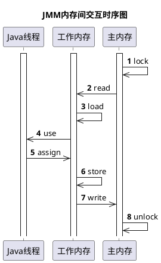

Java内存模型（Java Memory Model，JMM）是Java多线程读写共享内存中的一种规范，该规范支持了`synchronized`、`volatile`、`final`、`Lock`等Java并发工具。

前面介绍了JVM内存区域，JVM内存区域和Java内存模型是不同层次对内存的划分，Java内存模型侧重描述内存数据在多线程下的读写规则，一般关注**并发**编程下线程如何正确读写共享数据。

<!--more-->

## 一、定义

Java内存模型在JSR133规范（[JSR133草案](https://download.oracle.com/otn-pub/jcp/memory_model-1.0-pfd-spec-oth-JSpec/memory_model-1_0-pfd-spec.pdf)、[JSR133](https://www.cs.umd.edu/~pugh/java/memoryModel/jsr133.pdf)、[JSR133-中文版](http://ifeve.com/wp-content/uploads/2014/03/JSR133%E4%B8%AD%E6%96%87%E7%89%88.pdf)）中有详细的数学定义（JSR133第7小节），本文无意照本宣科引入复杂的数学概念（其实是因为看不懂囧，逃~），这里给出它的一个简单的定义（JSR133第4小节）：**Java内存模型是描述Java共享变量“可见性”的一组规则，该规则阐明了一个线程对共享变量的的写操作，何时能被另一个线程观察（读）到。**

> JSR草案中也提到了“有序性”、“原子性”等概念，它们可以辅佐“可见性”实现正确的并发。

## 二、内存交互

JMM有主内存和工作内存两个概念，主内存全局共享，工作内存线程独享。主内存可以类比为JVM内存区域中的“堆”，工作内存可以类比为JVM内存区域中的“栈”，但请注意，这样的类比只是便于理解，它们本身并不是相同的概念。

工作内存保存了主内存的变量副本，后续所有对变量的读写都在工作线程中进行，同时，本地内存的读写操作也将与主内存交互，由于这种交互机制的存在，不同线程对同一个变量的读写可能会发生延迟或紊乱，这也是多线程下JMM“可见性”需要解决的问题。

内存交互简单来说就是工作内存与主内存的同步读写，更宽泛来说，就涉及到8种操作，如下所示：

## 三、volatile的可见性特征

volatile，英文原意为“易变的”、“易失的”，这表明了工作内存中的volatile变量是不确定的，使得线程读写volatile变量时不相信当前本地内存中的值，而是立马去读写主内存中的值。结合上述内存交互的过程，volatile变量的读写有两个过程：

1. 线程往本地内存中更新一个volatile变量时，会立刻将之写到主内存中去。
2. 线程从本地内存读取一个volatile变量时，会先将之设置为无效，并立刻从主内存中读取。

上述过程保证了volatile的可见性：一个线程对volatile变量的修改对其它线程是马上可以被观察（读）到的。

同时，volatile也可以禁止重排序，当然，这个特性就和可见性没什么关系了。

## 四、总结

全文围绕“可见性”这个概念介绍了三点：JMM是描述Java共享变量“可见性”的一组规则，“可见性”问题普遍存在于主内存与共享内存的交互过程中，volatile是实现共享内存的“可见性”的一种方式。

JMM涉及到的概念众多，“可见性”显然只是其中一个，JMM中的“有序性”、“原子性”、“指令重排序”、“内存屏障”、“先行发生原则（Happens-Before）”等这些概念，以及Final、synchronized、Lock与JMM的关系，由于视野受限，当前暂时无法一一介绍，关于JMM的知识点个人还在持续学习中，上述内容存在理解偏差或需要补充的地方，后续将实时更新。

> 参考文档
1. 《深入理解Java虚拟机第3版 周志明 著》
2. 《Java并发编程的艺术 方腾飞 魏鹏 程晓明 著》
3. [Java Memory Model - LangNerd](https://www.langnerd.com/java-memory-model/#java_memory_model)
4. [JSR 133 (Java Memory Model) FAQ](http://www.cs.umd.edu/~pugh/java/memoryModel/jsr-133-faq.html#whatismm)