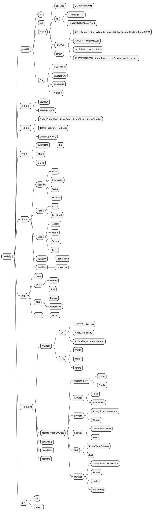

梳理Java开发所需的技能点，用于指导后续的学习路线，并提供系统性的查漏补缺方式。

<!--more-->

上图中，相同的概念会尽量放在一起，但根据关注点的不同，相同的概念也可能会体现在不同的节点下面（如：Redis可以同时出现在中间件与分布式缓存中，中间件中的Redis更关注Redis的基础特性，而分布式缓存更关注Redis的分布式特性）。

有部分概念比较相近，需要注意它们之间的区别，如：多线程下的`Java内存模型`与JVM下的`JVM内存结构`，两者不是同一个概念。

同时，由于技术的快速发展与个人视野的局限性，上图内容还不是很完善，后续将按需动态更新。

> 参考文档

1. 《深入理解Java虚拟机第3版 周志明 著》
2. 《Java并发编程的艺术 方腾飞 魏鹏 程晓明 著》