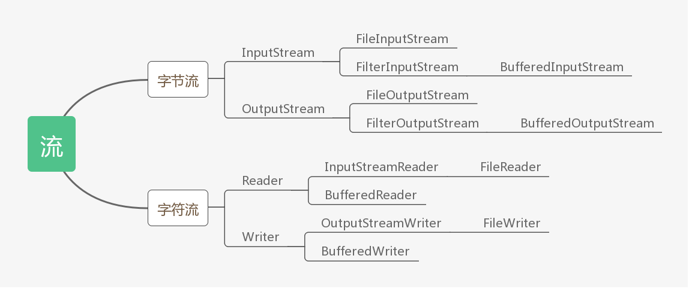

## 前言
文件分为文本文件和非文本文件（二进制文件，如音频、图片文件等），此处讨论的主要是文本文件。

文件的读写操作基于Java的I/O流，Java流分为字节流与字符流，它们都可以实现文件的读写操作。一般而言，字符流专注于处理文本文件，而字节流则更为通用，所有类型的文件均可操作。基于此，文本文件的读写操作有两种不同的策略：字节流文件读写与字符流文件读写。

<!--more-->

## 文件流的继承关系


## 用策略模式组织代码结构
策略模式的核心设计思想是：多种算法相互可替换，每一种算法称之为一种策略。本案例中文本文件的读写操作存在两个策略，即基于字节流的文件读写策略与基于字符流的文件读写策略。

### 抽象策略类——待实现功能的接口描述
文本文件的操作主要分为读和写两种，抽象策略类（接口）包含了这两个方法，其规定了其子类（具体策略类）需要实现的具体功能。
> RWStrategy.java
```
//抽象策略类
public interface RWStrategy {
	// 文件操作：读
	public String read(File file);

	// 文件操作：写
	public void write(File file, String content);
}

```

### 具体策略类——待实现功能的具体方案
具体策略类是抽象具体类（接口）的实现。下述代码中，`StrategyA`表示字节流文件读写策略，`StrategyB`表示字符流文件读写策略。
> RWStrategyA.java
```
//具体策略类
public class RWStrategyA implements RWStrategy {

	public String read(File file) {
		String content = "";
		try (FileInputStream fis = new FileInputStream(file); BufferedInputStream bis = new BufferedInputStream(fis);) {
			Long length = file.length();
			byte[] bytes = new byte[length.intValue()];
			bis.read(bytes);
			content = new String(bytes);
		} catch (Exception e) {
			e.printStackTrace();
		}
		return content;
	}

	public void write(File file, String content) {
		try (FileOutputStream fos = new FileOutputStream(file);
				BufferedOutputStream bos = new BufferedOutputStream(fos);) {
			byte[] bytes = content.getBytes();
			bos.write(bytes);
		} catch (Exception e) {
			e.printStackTrace();
		}
	}

	// 单例
	private static RWStrategyA strategy;

	public static RWStrategyA newInstance() {
		if (strategy == null) {
			strategy = new RWStrategyA();
		}
		return strategy;
	}

	private RWStrategyA() {
	};
}

```

> RWStrategyB.java
```
//具体策略类
public class RWStrategyB implements RWStrategy {

	public String read(File file) {
		String content = "";
		try (FileReader fr = new FileReader(file); BufferedReader br = new BufferedReader(fr)) {
			Long length = file.length();
			char[] chars = new char[length.intValue()];// 实际字符数组长度比这个小
			br.read(chars);
			content = new String(chars);
		} catch (Exception e) {
			e.printStackTrace();
		}
		return content;
	}

	public void write(File file, String content) {
		try (FileWriter fw = new FileWriter(file); BufferedWriter bw = new BufferedWriter(fw);) {
			char[] chars = content.toCharArray();
			bw.write(chars);
//			bw.write(content);
		} catch (Exception e) {
			e.printStackTrace();
		}
	}

	// 单例
	private static RWStrategyB strategy;

	public static RWStrategyB newInstance() {
		if (strategy == null) {
			strategy = new RWStrategyB();
		}
		return strategy;
	}

	private RWStrategyB() {
	};
}

```
由于具体策略类不需要创建多个对象，故使用到了单例模式。
在具体策略类中使用newInstance()方法获取单例对象，使类的创建与类的使用分离，这样其它类获取当前类的实例时就不需要使用new关键字了。

### 环境类
环境类是主类（使用策略的类）与策略类的桥梁。
环境类维护了一个具体策略类，这个具体策略类的选择由构造函数的参数决定。
- 构造方法一：直接注入具体策略类对象，这个具体策略类对象由主类创建
- 构造方法二：根据枚举值自动创建具体策略类对象
- 构造方法三：默认创建某一个具体策略类

同时，环境类提供了对应的接口方法，该方法将调用具体策略类中的对应方法，这样做的好处是可以隐藏策略类的细节，即使主类不需要知道策略类的具体方法名也能够调用对应的策略方法。
> RWContext.java
```
//环境类
public class RWContext {
	// 策略对象
	private RWStrategy strategy;

	// 构造函数：传入策略对象
	public RWContext(RWStrategy strategy) {
		this.strategy = strategy;
	}

	// 构造函数：传入策略枚举值
	public RWContext(RWStrategyEnum strategyEnum) {
		switch (strategyEnum) {
		case BYTE_STREAM_STRATEG:
			strategy = RWStrategyA.newInstance();
			break;
		case CHARACTER_STREAM_STRATEGY:
			strategy = RWStrategyB.newInstance();
			break;
		}
	}

	// 构造函数：默认
	public RWContext() {
		strategy = RWStrategyA.newInstance();
	}

	// 策略方法：从文件中读取内容
	public String readFromFile(File file) {
		return strategy.read(file);
	}

	// 策略方法：向文件中写入内容
	public void writeToFile(File file, String content) {
		strategy.write(file, content);
	}
}

```
枚举中有两个值，对应着两种策略，主要用于环境类中选择性创建具体策略类对象。
> RWStrategyEnum.java
```
public enum RWStrategyEnum {
	BYTE_STREAM_STRATEG, CHARACTER_STREAM_STRATEGY;
}
```

### 主类
通过主类类来测试两个具体策略类是否正常运行。
> RWMain.java
```
public class RWMain {

	static File file;
	static String content;

	public static void main(String args[]) throws IOException {
		file = new File("filerw.txt");
		if (!file.exists()) {
			file.createNewFile();
		}
		runStrategyA();
		runStrategyB();
	}

	public static void runStrategyA() {
		content = new SimpleDateFormat("yyyy-MM-dd hh:mm:ss ").format(new Date()) + "A\n";
		RWContext context = new RWContext(RWStrategyEnum.BYTE_STREAM_STRATEG);
		String beforeWrite = context.readFromFile(file);
		context.writeToFile(file, beforeWrite + content);
		String afterWrite = context.readFromFile(file);
		System.out.println("A策略：\n写入前：\n" + beforeWrite + "\n写入后:\n" + afterWrite);
	}

	public static void runStrategyB() {
		content = new SimpleDateFormat("yyyy-MM-dd hh:mm:ss ").format(new Date()) + "B\n";
		RWContext context = new RWContext(RWStrategyEnum.CHARACTER_STREAM_STRATEGY);
		String beforeWrite = context.readFromFile(file);
		context.writeToFile(file, beforeWrite + content);
		String afterWrite = context.readFromFile(file);
		System.out.println("B策略：\n写入前：\n" + beforeWrite + "写入后:\n" + afterWrite);
	}
}

```
## 总结
字节流可以处理所有文件，字节流只能处理文本文件，同时，字符流的底层实现依赖于字节流。虽然本案例中用到了两种方式对文本文件进行了读写操作，但是术业有专攻，一般更推荐使用字符流的方式处理文本文件。字符输入流的readline()方法可读取一行。

关于字节流，read()与read(bytes[])分别在什么时候用？

我的理解是：
- 当流中的字节数未知时使用read()，必须使用`while(InputStream.read()!=0)`一个字节一个字节读。
- 当流中的字节数已知时使用read(byte[]) ，创建指定长度的字节数组，然后调用`InputStream.read(byte[])`即可整体读入。

那么问题来了，什么时候字节数已知呢？
- 如果是文件流，那字节数组肯定已知，因为可以直接调用`File.length`获取字节长度。
- 其它情况统统按字节数未知处理，老老实实一个一个字节读。

over。