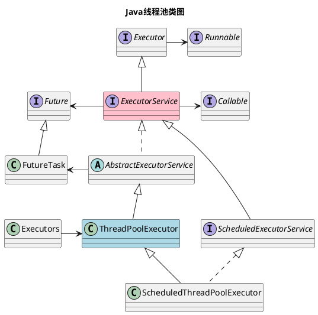

一般来说，Java中每一个任务都与其对应的线程共享生命周期，任务执行完毕后其线程也会跟着销毁，随着任务数量的增加，重复创建线程所带来的消耗所产生的性能影响也会更显著。线程池提供了一种复用多个线程的方案，以此避免无谓的线程创建，它通过管理线程们的生命周期和调度方式，为任务的批量执行提供更强的灵活性。

线程池主要是指`ThreadPoolExecutor`类，本文将围绕`ThreadPoolExecutor`类及其相关类，展开对线程池的介绍。

<!--more-->

## 一、线程池核心类之间的关系

线程池的核心类位于`JUC`包(即`java.util.concurrent`包)，该包保存了Java并发的大多数类，如：锁、阻塞队列、线程池等。

JUC下的线程池由若干核心类，他们的关系如下所示：




如果将上述类限定在线程池这一使用场景下，那么它们有以下分类：
- `ThreadPoolExecutor`类是线程池本体
- `ScheduledExecutorService`与`ScheduledThreadPoolExecutor`是支持延时任务的线程池变体
- `Executor`、`ExecutorService`与`AbstractExecutorService`是线程池的抽象定义
- `Runnable`和`Runnable`是线程池执行的任务
- `Future`和`FutureTask`是线程池异步执行的结果
- `Executors`是用于创建线程池的工具

> 当然，`Executor`等接口或类还有其它的应用场景，本文只限定于线程池场景。

## 二、ThreadPoolExecutor的使用

### （一）定义线程池

在使用线程池之前，需要先定义`ThreadPoolExecutor`，`ThreadPoolExecutor`的主要构造函数如下所示：

```java
public ThreadPoolExecutor(int corePoolSize,
                          int maximumPoolSize,
                          long keepAliveTime,
                          TimeUnit unit,
                          BlockingQueue<Runnable> workQueue,
                          ThreadFactory threadFactory,
                          RejectedExecutionHandler handler) {
```

上述参数的含义为：

| 参数                              | 含义                                                         |
| --------------------------------- | ------------------------------------------------------------ |
| int corePoolSize                  | 核心线程容量                                                 |
| int maximumPoolSize               | 最大线程容量( = 核心线程容量 + 非核心线程容量 )              |
| long keepAliveTime                | 非核心线程存活时间(如果设置了allowCoreThreadTimeOut，也对核心线程有效) |
| TimeUnit unit                     | 存活时间单位                                                 |
| BlockingQueue<Runnable> workQueue | 等待队列                                                     |
| ThreadFactory threadFactory       | 线程创建工厂                                                 |
| RejectedExecutionHandler handler  | 饱和时的拒绝策略                                             |

核心线程池有三个抽象区域：核心线程区、非核心线程区以及等待队列。分别对应了上述的`corePoolSize`、`maximumPoolSize`以及`workQueue`，其中，`maximumPoolSize`为最大线程容量，`maximumPoolSize`-`corePoolSize`即是非核心线程容量。

同时，`最大并发数 = 最大线程容量 + 等待队列容量`。

也有，`最大并发数 = 核心线程容量 + 非核心线程容量 + 等待队列容量`。

当设置完上述三个值后，线程池的处理上限也将基本确定。后续将按照`核心线程池 -> 等待队列 -> 非核心线程池`的顺序依次执行任务，有关线程池的内部逻辑，详见后文[ThreadPoolExecutor原理浅析](#三threadpoolexecutor原理浅析)。

一般建议直接使用`ThreadPoolExecutor`的构造方法来实例化线程池，这样更容易通过参数识别线程池的关键属性。当然，为了简单起见，也可以使用`Executors`的系列方法：`newFixedThreadPool()`、`newSingleThreadExecutor()`与`newScheduledThreadPool()`，下面以`newFixedThreadPool()`为例来初始化一个线程池：

```java
// 1.定义线程池
ExecutorService threadPoolExecutor = Executors.newFixedThreadPool(10);
```

`Executors`的`newxxxThreadPool()`系列方法是对`ThreadPoolExecutor`构造方法的简单封装，可以用它来快速创建一个默认的线程池。但是，如果你的本地IDE环境安装了阿里巴巴的规范插件，使用`Executors`时可能会收到到一条警告：不建议使用`Executors`的`newxxxThreadPool()`系列方法，那是因为`Executors`有默认使用无界阻塞队列的情况，可能会导致内存泄露，同时，`Executors`掩盖了创建线程池的细节，没法快速识别线程池的关键属性。当然，最终是否要使用`Executors`就见仁见智了。

### （二）使用线程池

线程池有两种执行方式：同步执行与异步执行。

#### 1. 同步执行

同步执行会阻塞当前线程，直到任务执行完毕。

可以使用`Executor`的`void execute(Runnable command)`方法来实现同步执行，如下所示：

```java
// 2. 使用线程池:同步执行
Runnable synchronousTask = new Thread();
threadPoolExecutor.execute(synchronousTask);
```

#### 2. 异步执行

异步执行不会阻塞当前线程，执行的结果会存放在`Future`对象中，这个对象一般也是`FutureTask`对象。

可以使用执行`ExecutorService`的`submit()`系列方法来异步执行，`submit()`有三个重载方法，如下所示：

```java
<T> Future<T> submit(Callable<T> task);
<T> Future<T> submit(Runnable task, T result);
Future<?> submit(Runnable task);
```

上述重载方法中，`Runnable`参数最终也会转换成`Callable`。以`Future<?> submit(Runnable task)`为例，异步执行任务的使用方法如下所示：

```java
// 3. 使用线程池:异步执行
Runnable asynchronousTask = new Thread();
Future<?> future = threadPoolExecutor.submit(asynchronousTask);
//Object object = future.get();
```
`submit()`本身是异步的，最终得到`future`后，调用`future.get()`可以得到结果，此时的`get()`是同步的。

### （三）关闭线程池

使用完线程池后，需要将之关闭以节省资源。

关闭线程池可以使用`shutdown()`或`shutdownNow()`，它们的区别是：`shutdown()`会在执行完正在运行的线程后退出，等待中的线程将被丢弃；`shutdownNow()`则会直接停止正在运行的线程，并将未执行的任务返回(包括正在运行的线程和等待中的线程)。

关闭线程池的使用方法如下所示：

```java
// 4. 关闭线程池
threadPoolExecutor.shutdown();
//threadPoolExecutor.shutdownNow();
```

### （四）完整的例子

上述定义线程池、使用线程池及关闭线程池的完整例子如下：

```java
// 1.定义线程池
ExecutorService threadPoolExecutor = Executors.newFixedThreadPool(10);

// 2. 使用线程池:同步执行
Runnable synchronousTask = new Thread();
threadPoolExecutor.execute(synchronousTask);

// 3. 使用线程池:异步执行
Runnable asynchronousTask = new Thread();
Future<?> future = threadPoolExecutor.submit(asynchronousTask);
//Object object = future.get();

// 4. 关闭线程池
threadPoolExecutor.shutdown();
//threadPoolExecutor.shutdownNow();
```

## 三、ThreadPoolExecutor原理浅析

`ThreadPoolExecutor`的核心处理逻辑位于`execute`方法中，该方法在jdk6与jdk7中有些许差异，如下所示：

1. jdk6及以前的`execute`方法

```Java
public void execute(Runnable command) {
    if (command == null)
        throw new NullPointerException();
    if (poolSize >= corePoolSize || !addIfUnderCorePoolSize(command)) {
        if (runState == RUNNING && workQueue.offer(command)) {
            if (runState != RUNNING || poolSize == 0)
                ensureQueuedTaskHandled(command);
        }
        else if (!addIfUnderMaximumPoolSize(command))
            reject(command);
    }
}
```

2. jdk7及以后的`execute`方法

```Java
public void execute(Runnable command) {
    if (command == null)
        throw new NullPointerException();
    int c = ctl.get();
    if (workerCountOf(c) < corePoolSize) {
        if (addWorker(command, true))
            return;
        c = ctl.get();
    }
    if (isRunning(c) && workQueue.offer(command)) {
        int recheck = ctl.get();
        if (! isRunning(recheck) && remove(command))
            reject(command);
        else if (workerCountOf(recheck) == 0)
            addWorker(null, false);
    }
    else if (!addWorker(command, false))
        reject(command);
}
```

// TODO


> 参考文档

1. 《Java并发编程的艺术 方腾飞 魏鹏 程晓明 著》