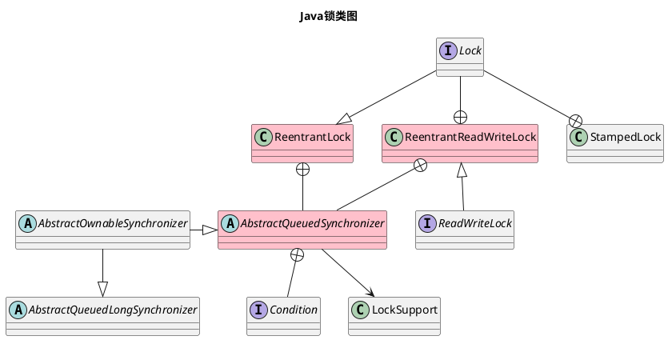

Java锁(Lock)是实现Java线程安全的一种手段，它通过加锁和解锁的过程来实现线程间的同步，以保证多线程在竞争同一个公共资源时数据读写的正确性。

本文将首先阐明[Lock在Java线程安全中的位置](#一、前言)，随后将简单介绍[`Lock`类之间的关系](#二、Lock类之间的关系)，最后将简单介绍Java锁的[抽象定义](#三、java锁的抽象定义)与[具体实现](#四、java锁的具体实现)。

<!--more-->

## 一、前言

保证Java线程安全有三种方式：阻塞(互斥)同步、非阻塞同步、无同步。本文将要介绍的锁(Lock)可以是阻塞同步(如：`ReentrantReadWriteLock`的写操作)，也可以是非阻塞同步(如：`StampedLock`的`tryOptimisticRead`读操作)，下面将简单介绍一下这三种方式。

互斥同步是`悲观锁`，悲观锁意味着“悲观地认为资源**大概率会**被同时访问，所以采取先加锁再操作数据的策略”，常见的实现方法是`synchronized`与部分`Lock`类，一般情况下，`Lock`与`synchronized`可以相互替换。

非阻塞同步是`乐观锁`，乐观锁意味着“乐观地认为资源**大概率不会**被同时访问，所以采取先操作数据再判断并发状态的策略”，常见的实现方法是`CAS`原子操作(如：`Atomic`系列类)。`乐观锁`虽然带有`锁`字，但其实并没有真正加锁与解锁的过程，只是用来和`悲观锁`加以区分，因此也可以将之称之为`无锁`同步。

除了互斥同步与非阻塞同步两种同步方案外，还有一种`无同步`方案，常见的实现方法是`ThreadLocal`与`volatile`等。


## 二、Lock类之间的关系

与Java锁相关的10个类都在`java.util.concurrent.locks`包下面，它们之间的关系如下所示：



上述大部分类都是在jdk5中新增的，其中`AbstractOwnableSynchronizer`与`AbstractQueuedLongSynchronizer`在jdk6中新增，`StampedLock`在jdk8中新增。

`Lock`接口是锁的原型，队列同步器`AbstractQueuedSynchronizer`(`AQS`)是锁的实现基础，可重入锁`ReentrantLock`、读写锁`ReentrantReadWriteLock`与增强型读写锁`StampedLock`是锁的三种具体实现。


## 三、Java锁的抽象定义

Lock接口定义了锁的使用方法，AQS类定义了锁的实现规范。

### （一）Lock接口

在jdk5之前，一般使用`synchronized`关键字实现同步，jdk5后，Lock也成为了一种更灵活的可选项。这里的Lock是广义的Lock，指的是`java.util.concurrent.locks`包的集合，狭义的`Lock`接口是这个集合中的一个元素，本小节介绍的是狭义的`Lock`接口。

> jdk后续版本，java团队从虚拟机层面对`synchronized`关键字做了一系列优化，如：适应性自旋、锁消除、锁膨胀、轻量级锁、偏向锁等。

Lock接口有以下主要方法：
- lock：获取锁(加锁)
- tryLock：尝试获取锁
- unlock：释放锁

下面罗列了jdk官方文档中两种使用锁的模板：

1. 使用`lock`与`unlock`

```java
Lock lock = ...; //定义并实例化锁
lock.lock(); // 获取锁
try {
    // 操作被锁保护的资源
} finally {
    lock.unlock(); // 释放锁
}
```

2. 使用`tryLock`与`unlock`

```java
Lock lock = ...; //定义并实例化锁
if (lock.tryLock()) { // 尝试获取锁：成功
    try {
    // 操作被锁保护的资源
    } finally {
        lock.unlock(); // 释放锁
    }
} else { // 尝试获取锁：失败
// 执行其它流程
}
```

### （二）AQS类

队列同步器`AbstractQueuedSynchronizer`(`AQS`)是Java锁的基础，后续即将介绍的[三种Java锁](#四、Java锁的具体实现)都有对应的`AQS`内部类实现。

`AQS`中有两个关键的数据元素：

1. 同步状态
2. 同步队列

其中，同步状态是一个`volatile int`类型的值，该值可以表示为持有锁的个数(如2表示持有2个锁，0表示不持有锁)。`AQS`使用`getState`、`setState`及`compareAndSetState`这三个方法来获取或修改state值。同时，同步队列是一个以自定义元素`Node`为节点的双向链表结构，该队列可以保存同步阻塞时的节点信息。

`AQS`通过`acquire`及`release`系列方法来修改上述两个数据元素，来达到同步控制的目的。在这个过程中，有5个模板方法：`tryAcquire`、`tryRelease`、`tryAcquireShared`、`tryReleaseShared`、`isHeldExclusively`，它们默认会抛出`UnsupportedOperationException`异常，AQS的实现类需要去自定义它们的逻辑。

上面引出来了`AQS`中定义的一些关键方法，它们和`Lock`接口中的方法存在一定的依赖关系。从锁的使用到锁的实现，有以下两条调用链路：

1. 加锁：`Lock.lock()` --> `AQS.acquire()` --> `AQS.tryAcquire()` --> xxx
2. 解锁：`Lock.unlock()` --> `AQS.release()` --> `AQS.tryRelease()` --> xxx

`Lock`实现类的加锁和解锁过程通过`AQS`类来实现，`Lock`与`AQS`共同组成了Java锁的抽象定义，为后面的[Java锁的具体实现](#四、Java锁的具体实现)做好了铺垫。

## 四、Java锁的具体实现

### （一）可重入锁

`ReentrantLock`是一个**可重入**的**互斥**锁，它与`synchronized`有相同的基础行为和语义，但比`synchronized`更有扩展性。

上面提到了两个概念，“互斥”与“可重入”，接下来将分别简单介绍这两个词的含义：

- 互斥：`ReentrantLock`只能被一个线程所持有，当这个线程调用`lock`方法获得锁，并且没有调用`unlock`方法释放锁时，其它线程将无法获取该锁，只能处于等待状态。

- 可重入：持有锁的线程可以反复获得这个锁(比如在递归场景中)，这意味着当前线程可以重复进入被加锁的区域，而无需等待锁释放。每次执行`lock`方法都会导致同步状态`state`的值加1，执行`unlock`方法则会减1，`lock`与`unlock`成对生效时，才会最终释放当前线程的锁。

`ReentrantLock`通过构造函数中的`fair`来决定创建公平锁(FairSync)或非公平锁(NonfairSync)，默认为非公平锁。公平锁能够保证等待越久的线程越能优先获取到锁(通过`hasQueuedPredecessors`方法实现)，从而保证不同线程在获取锁阻塞时等待时间的公平性。一言以蔽之，**非公平锁可以插队(不保证顺序)，而公平锁一般不能插队(保证FIFO的顺序)**

下面以一个简单的例子说明一下`ReentrantLock`的使用方法：

```java
class StatusHolder {
    private int status;
    private final Lock lock = new ReentrantLock();

    // 以传统的synchronized的方式同步修改状态
    public void changeStatusWithSynchronized(int status) {
        synchronized (this) {
            this.status = status;
        }
    }

    // 以Lock.lock()的方式同步修改状态
    public void changeStatusWithLock(int status) {
        lock.lock();
        try {
            this.status = status;
        } finally {
            lock.unlock();
        }
    }

    // 以Lock.tryLock()的方式同步修改状态
    public void changeStatusWithTryLock(int status) {
        if (lock.tryLock()) {
            try {
                this.status = status;
            } finally {
                lock.unlock();
            }
        } else {
            // 获取锁失败，执行其它流程
        }
    }
}

```

上面使用三种方法来实现“修改状态”这一功能。作为对比，第一种使用的是传统的`synchronized`方式，第二种与第三种则是`ReentrantLock`的方式。`synchronized`与`ReentrantLock`在某些情况下可以互相替换，但`ReentrantLock`灵活度更高(比如可以实现超时等待)。


### （二）读写锁

`ReadWriteLock`接口维护了一对读锁和写锁。读锁可以被多个线程共享（非互斥），而写锁只能被一个线程持有（互斥）。这一特性也表明了`ReadWriteLock`更适合用于读多写少的场景。

根据读写锁的排列组合，有以下四种情况：

1. 一个线程持有**读**锁后，另一个线程尝试获取**读**锁
2. 一个线程持有**读**锁后，另一个线程尝试获取**写**锁
3. 一个线程持有**写**锁后，另一个线程尝试获取**读**锁
4. 一个线程持有**写**锁后，另一个线程尝试获取**写**锁

`ReadWriteLock`中仅有第一个场景的同时读操作是共享的（这也是使用读写锁时大概率会发生的场景），其它三种情况一般情况下都是互斥的。

`ReadWriteLock`当前有两个实现类：`ReentrantReadWriteLock`与`StampedLock`。`ReentrantReadWriteLock`是可重入的读写锁，它在读写锁的基础上支持重入操作。`StampedLock`是增强型的读写锁，它支持在读的过程中执行写操作（也即是上述排列组合的第2中情况），使用乐观读锁与悲观读锁的组合可以避免同时读写造成的脏读现象。同时，`StampedLock`是不可重入的。

接下来将以`ReentrantReadWriteLock`为例介绍读写锁的简单使用方法：

```Java
class StatusHolder {
    private int status;
    private final ReadWriteLock readWriteLock = new ReentrantReadWriteLock();
    private final Lock readLock = readWriteLock.readLock();
    private final Lock writeLock = readWriteLock.writeLock();

    // 写入状态
    public void writeStatus(int status) {
        writeLock.lock(); // 加写锁
        try {
            this.status = status;
        } finally {
            writeLock.unlock();
        }
    }

    // 读取状态
    public int readState(int status) {
        readLock.lock(); // 加读锁
        try {
            return status;
        } finally {
            readLock.unlock();
        }
    }
}
```

`StampedLock`的使用方法与`ReentrantReadWriteLock`类似，只需要在进行读操作时，优先使用乐观读锁读取数据，并校验此过程中是否有写操作，如果校验成功，直接使用乐观锁的结果；反之，则获取悲观读锁再次读取数据，以避免脏读。

## 四、总结

至此，有关Java锁的基础内容已经介绍完毕。前面首先介绍了锁在线程安全中的重要性，并列出了Java并发包中与锁的相互关系，随后分别介绍了具体的几个核心类：`Lock`与`AQS`是Java锁的抽象定义，而可重入锁与读写锁则是两种Java锁的具体实现。

本文更偏向于基础概念的简介，源码的实现细节暂时没有涉及，由于理解有限，上述内容可能会有偏差，后续将按需修改或增加相关内容。

同时，上述介绍的Java锁只适用于单机环境，分布式环境则使用分布式锁实现同步。有关分布式锁的内容，将在后续介绍。

> 参考文档

1. 《深入理解Java虚拟机第3版 周志明 著》
2. 《Java并发编程的艺术 方腾飞 魏鹏 程晓明 著》
3. [廖雪峰的官方网站-多线程](https://www.liaoxuefeng.com/wiki/1252599548343744/1255943750561472)
