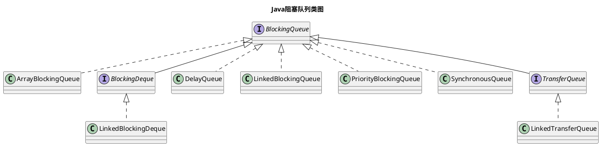

Java阻塞队列是一种可以实现**阻塞插入**和**阻塞移除**的特殊队列，它被广泛应用于生产者消费者模式。如在线程池中，可以使用`LinkedBlockingQueue`与`SynchronousQueue`等阻塞队列来生产与消费线程对象。

下面将简单介绍Java中常用的几个阻塞队列。

<!--more-->

## 一、阻塞队列汇总

阻塞队列位于`JUC`包(即`java.util.concurrent`包)，该包保存了Java并发的大多数类，如：锁、阻塞队列、线程池等。

JUC下的阻塞队列共有3个接口与7个实现类，他们的关系如下所示：

上述类图中，`BlockingQueue`是阻塞队列的顶层接口，`BlockingDeque`与`TransferQueue`则是继承自`BlockingQueue`的两个用于实现特殊功能的接口。剩下的7个阻塞队列实现类均实现了上述3个接口，它们如下所示：

| 阻塞队列类            | JDK版本 | 有界性                   |
| --------------------- | ------- | ------------------------ |
| ArrayBlockingQueue    | 5       | 有界(bounded)            |
| LinkedBlockingQueue   | 5       | 有界(optionally-bounded) |
| PriorityBlockingQueue | 5       | 无界(unbounded)          |
| DelayQueue            | 5       | 无界(unbounded)          |
| SynchronousQueue      | 5       | -                        |
| LinkedBlockingDeque   | 6       | 有界(optionally-bounded) |
| LinkedTransferQueue   | 7       | 无界(unbounded)          |

> 除了阻塞队列外，JUC包下还有一个非阻塞队列：`ConcurrentLinkedQueue`，该类不在本节讨论之中。

## 二、阻塞队列概述

### （一）阻塞队列的抽象定义：BlockingQueue

`BlockingQueue`定义了阻塞队列的抽象结构，所有的阻塞队列都需要实现它。`BlockingQueue`的核心方法如下所示：

| 方法 | 抛出异常  | 返回特殊值 | 阻塞   | 超时阻塞             |
| ---- | --------- | ---------- | ------ | -------------------- |
| 插入 | add(e)    | offer(e)   | put(e) | offer(e, time, unit) |
| 移除 | remove()  | poll()     | take() | poll(time, unit)     |
| 检查 | element() | peek()     | -      | -                    |

在对队列执行以下三种操作时：

1. 在队列满时插入元素：使用`add`、`offer`、`put`插入方法
2. 在队列空时移除元素：使用`remove`、`poll`、`take`移除方法
3. 在队列空时检查元素：使用`element`、`peek`检查方法

一定会执行失败，此时根据使用方法的不同，可能会出现以下四种情况：

1. 抛出异常
2. 返回特殊值(如null或false)
3. 阻塞
4. 超时阻塞

其中，只有**阻塞**与**超时阻塞**的4个方法是`BlockingQueue`接口独有的(这也是阻塞队列需要重点关注的方法)，而**抛出异常**与**返回特殊值**的6个方法则是继承自`Queue`接口。后续讲到的几种具体的阻塞队列实现，都需要实现上述方法。

### （二）常规阻塞队列：ArrayBlockingQueue与LinkedBlockingQueue

`ArrayBlockingQueue`是使用**数组**实现的有界(bounded)阻塞队列，`LinkedBlockingQueue`是使用**链表**实现的有界(optionally-bounded)阻塞队列。它们都符合普通队列的`FIFO`(first-in-first-out，先入先出)原则：新增元素时在队尾插入，移除元素时从队首删除，队首的元素存在时间最长，队尾元素存在时间最短。

为了实现阻塞插入或阻塞移除，`ArrayBlockingQueue`与`LinkedBlockingQueue`均使用`ReentrantLock`锁来实现同步，当队列满时或队列空时，执行阻塞的插入或移除操作(如:`put`或`take`)，会导致持有锁的线程将进入自旋等待状态，而其它线程因为无法获取到锁，也将进入等待状态，直到队列非满或非空时，等待状态才可以解除。

其中，`ArrayBlockingQueue`只有一个锁，可以通过构造函数的`fair`参数来指定该锁的公平性。而`LinkedBlockingQueue`则有两个锁：`takeLock`与`putLock`，它们都是默认的非公平锁，`takeLock`可以由`take`、`poll`等方法持有，`putLock`可以由`put`、`offe`等方法持有。

`LinkedBlockingQueue`可以用来实现`FixedThreadPool`线程池(详见`Executors`的`newFixedThreadPool(int nThreads)`方法)。

在大多数并发应用中，`LinkedBlockingQueue`比`ArrayBlockingQueue`有更高的吞吐量，但有更低的性能可预测性(*Linked queues typically have higher throughput than array-based queues but less predictable performance in most concurrent applications.*)

### （三）优先阻塞队列：PriorityBlockingQueue与DelayQueue

`PriorityBlockingQueue`和`DelayQueue`都是使用`PriorityQueue`实现的无界(unbounded)阻塞队列，它们都使用`ReentrantLock`锁来实现同步。

其中，`PriorityBlockingQueue`可以通过`Comparator`来自定义队列元素的优先级。`DelayQueue`通过`Delayed`泛型元素实现延时获取元素。`DelayQueue`可以用来设计缓存系统与定时任务调度。

### （四）无容量阻塞队列：SynchronousQueue

`SynchronousQueue`是一个没有任何容量的阻塞队列(其`capacity`值为0)，每一个插入操作都必须等待另一个线程对应的移除操作，反之亦然。`SynchronousQueue`使用`ReentrantLock`锁来实现同步，可以通过`fair`参数来指定该锁的公平性。

`SynchronousQueue`可以用来实现`CachedThreadPool`线程池(详见`Executors`的`newCachedThreadPool()`方法)。

### （五）双向阻塞队列：BlockingDeque与LinkedBlockingDeque

`LinkedBlockingDeque`是使用双向链表实现的有界(optionally-bounded)阻塞队列，它实现了`BlockingDeque`接口。`LinkedBlockingDeque`使用`ReentrantLock`锁来实现同步。

`LinkedBlockingDeque`可以用来实现工作窃取模式(即ForkJoin系列类)。

### （六）Transfer阻塞队列：TransferQueue与LinkedTransferQueue

`LinkedTransferQueue`是使用链表实现的无界(unbounded)阻塞队列，它实现了`TransferQueue`接口。

可以将`LinkedTransferQueue`看作是`LinkedBlockingQueue`与`SynchronousQueue`的结合。`LinkedTransferQueue`的`transfer`方法会优先将生产者传入的元素立刻传输给消费者，此过程类似于`SynchronousQueue`。如果没有对应的消费者生产者传入的元素，会将之放到队列中，此过程类似于`LinkedTransferQueue`。

## 三、总结

JUC包下定义了10个阻塞队列相关的接口或类。简单将它们分下类如下所示：

- `BlockingQueue`作为顶层接口定义了阻塞队列的阻塞队列
- `ArrayBlockingQueue`与`LinkedBlockingQueue`是两个最基础的阻塞队列实现
- `PriorityBlockingQueue`与`DelayQueue`是实现了优先级与延时获取的阻塞队列
- `SynchronousQueue`是不存储元素并直接传递元素的阻塞队列
- `LinkedBlockingDeque`是实现了`BlockingDeque`接口的双向阻塞队列
- `LinkedTransferQueue`是实现了`TransferQueue`接口的阻塞队列，可以将其看作`LinkedBlockingQueue`与`SynchronousQueue`的结合。

本文更偏向于阻塞队列基础概念的简介，很多内容只是一笔带过，没有详细介绍，由于理解有限，上述内容可能会有偏差，后续将按需修改或增加相关内容。

锁是阻塞队列的基础，上面提到的大部分阻塞队列都是使用`ReentrantLock`锁来实现同步。同时，阻塞队列又是线程池的基础，有关线程池的内容，将在后续介绍。

> 参考文档

1. 《Java并发编程的艺术 方腾飞 魏鹏 程晓明 著》