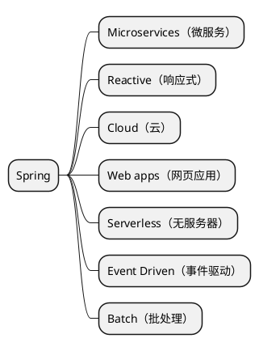

[Spring官网](https://spring.io)中描述了Spring能做的7件事，如下所示：

下面将简单介绍各场景的概念与其关联的项目。

<!--more-->

## 一、[Microservices](https://spring.io/microservices)

微服务（Microservice）是一个小型的、高度自含的、随时可运行的软件实体，多个相互独立的微服务协同工作构成的微服务架构，可以替代掉传统的大而全的单体服务架构，带来更高的灵活性。

微服务在Spring中涉及到的项目如下：

| 项目                                                         | 功能                                                         |
| ------------------------------------------------------------ | ------------------------------------------------------------ |
| [Spring Boot](https://spring.io/projects/spring-boot)        | 快速搭建一个微服务（Java微服务的事实标准）                   |
| [Spring Cloud](https://spring.io/projects/spring-cloud)      | 使多个微服务更好地支持分布式特性（服务发现、负载均衡、熔断、分布式跟踪、监控等） |
| [Spring Cloud Stream](https://spring.io/projects/spring-cloud-stream) | 使微服务可以处理实时消息，以构建一个高度可伸缩的、事件驱动的系统 |
| [Micrometer](https://micrometer.io)                          | 监控微服务的各项指标                                         |

## 二、[Reactive](https://spring.io/reactive)

响应式（Reactive）系统可以实现低延迟与高吞吐，它有几个特性：快速响应（responsive）、可恢复（resilient）、有弹性（elastic）与消息驱动（ message-driven）。响应式处理是一种范式，它可以帮助开发者开发出非阻塞的、异步的应用，这种应用可以处理回压（back-pressure），其中，“回压”是指在应用处理能力达到阀值时的一种反馈现象。

响应式在Spring中涉及到的项目如下：

| 项目                                                         | 功能                                                         |
| ------------------------------------------------------------ | ------------------------------------------------------------ |
| [Reactor](https://projectreactor.io)                         | Spring响应式的基础，Spring WebFlux、Spring Data和Spring Cloud Gateway都用到了它 |
| [Spring WebFlux](https://docs.spring.io/spring-framework/docs/current/reference/html/web-reactive.html) | 非阻塞性Web框架，相对于Spring MVC而言，可以使用更少的资源处理更多的请求 |
| [Spring Data](https://spring.io/projects/spring-data)        | （原生）支持以响应式的方式访问数据库资源（如MongoDB、Redis 和 Cassandra） |
| [R2DBC](https://github.com/r2dbc)                            | （三方）支持以响应式的方式访问数据库资源（如Postgres、Microsoft SQL Server、 MySQL、H2和 Google Spanner)） |
| [Spring Cloud Stream](https://spring.io/projects/spring-cloud-stream) | 支持以响应式的方式访问消息资源（如RabbitMQ和Kafka）          |

## 三、[Cloud](https://spring.io/cloud)

云（Cloud）原生应用要求微服务在分布式场景中满足[12-Factor ](https://12factor.net/zh_cn/)，Spring Cloud套件包含了许多让应用程序在云中运行所需的服务（如服务发现、网关、配置、熔断、链路跟踪等）。

云原生在Spring中涉及到的项目如下：

| 项目                                                         | 功能     |
| ------------------------------------------------------------ | -------- |
| [Eureka](https://github.com/Netflix/eureka)                  | 服务发现 |
| [Consul](https://www.consul.io/)                             | 服务发现 |
| [Zookeeper](https://spring.io/projects/spring-cloud-zookeeper) | 服务发现 |
| [Spring Cloud Gateway](https://spring.io/projects/spring-cloud-gateway) | 网关     |
| [Spring Cloud Config](https://spring.io/projects/spring-cloud-config) | 配置     |
| [Spring Cloud Circuit Breaker](https://spring.io/projects/spring-cloud-circuitbreaker) | 熔断     |
| [Resilience4J](https://resilience4j.readme.io/docs/getting-started) | 熔断     |
| [Sentinel](https://github.com/alibaba/Sentinel/wiki/Circuit-Breaking) | 熔断     |
| [Hystrix](https://github.com/Netflix/Hystrix/wiki)           | 熔断     |
| [Spring Cloud Sleuth](https://spring.io/projects/spring-cloud-sleuth) | 链路跟踪 |
| [Zipkin](https://zipkin.io/)                                 | 链路跟踪 |
| [Spring Cloud Contract](https://spring.io/projects/spring-cloud-contract) | 测试     |

## 四、[Web apps](https://spring.io/web-applications)

使用Spring构建的网页应用（Web apps）去掉了大量样板代码和配置（得益于SpringBoot的支持），它简化了服务端HTML应用、REST接口等的开发。

网页应用在Spring中涉及到的项目如下：

| 项目                                                         | 功能                 |
| ------------------------------------------------------------ | -------------------- |
| [Spring Boot](https://spring.io/projects/spring-boot)        | 网页应用脚手架       |
| [Spring Security](https://spring.io/projects/spring-security) | 网页应用安全支持     |
| [Spring Data](https://spring.io/projects/spring-data)        | 网页应用数据访问支持 |

## 五、Serverless](https://spring.io/why-spring)

无服务器（Serverless）顾名思义，就是指无需关注服务器等基础设施而只需要关注业务逻辑的一种模型，它在一些情况下与FaaS（功能即服务）等价，国内的Serverless实现有腾讯云的“云函数 SCF”与阿里云的“函数计算 FC”。

无服务器在Spring中涉及到的项目如下：

| 项目                                                         | 功能                     |
| ------------------------------------------------------------ | ------------------------ |
| [Spring Cloud Function](https://spring.io/projects/spring-cloud-function) | 提供无服务器（FaaS）支持 |

## 六、[Event Driven](https://spring.io/event-driven)

事件驱动（Event Driven）也可使称之为消息驱动，每一个事件驱动的系统都是基于消息处理来实现的。

| 项目                                                         | 功能                     |
| ------------------------------------------------------------ | ------------------------ |
| [Spring Cloud Stream](https://spring.io/projects/spring-cloud-stream) | 提供“Binders”、“Bindings”和“Messages”三个核心概念来帮助更好地连接Kafka与RabbitMQ等消息组件 |
| [Spring Cloud Function](https://spring.io/projects/spring-cloud-function) | 更好地处理多个消息的输入与输出，如合并、连接等操作 |
| [Spring Cloud Data Flow](https://dataflow.spring.io) | 提供跨多个云原生平台处理各种数据源的工具 |
| [Spring AMQP](https://spring.io/projects/spring-amqp) | 支持AMQP（Advanced Message Queuing Protocol，高级消息队列协议） |
| [Spring Kafka](https://spring.io/projects/spring-kafka) | 支持Apache  Kafka |

## 七、[Batch](https://spring.io/batch)

批处理（Batch）用于处理大量数据，处理过程中不需要外部交互且不会中断。

