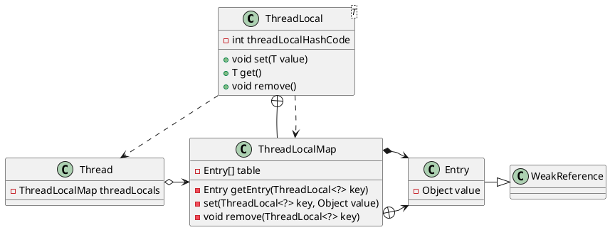

ThreadLocal是一种实现线程安全的机制，它提供了访问线程局部变量（thread-local variables）的方法，线程局部变量与普通变量的不同之处在于，线程局部变量在每一个线程中的值都是独立的，这保证了在多线程环境下不会出现线程串用的问题。

<!--more-->

> 还可以使用同步来实现线程安全，如：互斥同步（synchronized、ReentrantLock）与非阻塞同步（atomic原子类），ThreadLocal属于非同步方案。


## 一、ThreadLocal的使用

日志记录ID是一个很常见的Web应用场景：在请求开始时生成一个TID，在响应返回前的任何时候都可以使用这个TID，其中，TID的生成与获取一般位于在不同的地方，并且每个线程的TID都是相互独立的。使用ThreadLocal可以轻松实现上述过程，如下所示：

```java
public class TransactionHolder {
    // 定义ThreadLocal
    private static final ThreadLocal<String> transactionIdThreadLocal = new ThreadLocal<>();

    private void setTransactionId(String transactionId) {
        // 设值
        transactionIdThreadLocal.set(transactionId);
    }

    private String getTransactionId() {
        // 取值
        return transactionIdThreadLocal.get();
    }

    private void removeTransactionId() {
        // 删值
        transactionIdThreadLocal.remove();
    }
}
```


具体来说，ThreadLocal的使用分为以下几步：

1. 定义`ThreadLocal`属性

    一般使用private static来修饰它，static保证线程局部变量的唯一性，如果不加static，每个TransactionHolder实例将维护不同的transactionIdThreadLocal，这样没有意义且在某些时候甚至可能会出错。

2. 使用`set()`方法

    为当前线程局部变量赋值。

3. 使用`get()`方法

    读取当前线程局部变量的值。

4. 使用`remove()`方法

    移除线程局部变量，防止内存泄漏。


## 二、ThreadLocal源码分析

ThreadLocal源码涉及到Thread、ThreadLocalMap、Entry几个类，如下图所示：



ThreadLocal通过Thread.currentThread()获取到当前线程实例，并获取到当前线程实例的ThreadLocalMap属性，通过操作ThreadLocalMap中的Entry来实现线程局部变量的读写。

接下来简单分析一下`ThreadLocal`的`set()`方法、`get()`方法及`remove()`方法

1. set()方法

```java
public void set(T value) {
    Thread t = Thread.currentThread(); // 获取当前线程实例
    ThreadLocalMap map = getMap(t); // 获取当前线程实例的ThreadLocalMap属性
    if (map != null) { 
        map.set(this, value); // 设值
    } else {
        createMap(t, value); // map不存在时，创建ThreadLocalMap，并设值
    }
}
```

2. get()方法

```java
public T get() {
    Thread t = Thread.currentThread(); // 获取当前线程实例
    ThreadLocalMap map = getMap(t); // 获取当前线程实例的ThreadLocalMap属性
    if (map != null) {
        ThreadLocalMap.Entry e = map.getEntry(this); // 根据当前ThreadLocal的threadLocalHashCode，在map中找到对应的Entry实例
        if (e != null) {
            @SuppressWarnings("unchecked")
            T result = (T)e.value;
            return result; // 取值
        }
    }
    return setInitialValue(); // map不存在时，创建map，返回默认值null
}
```
3. remove()方法

```java
public void remove() {
    ThreadLocalMap m = getMap(Thread.currentThread()); // 获取当前线程实例的ThreadLocalMap属性
    if (m != null) {
        m.remove(this); // 删值
    }
}
```

可以看到，ThreadLocal的读写实际上就是对ThreadLocalMap的读写，其中ThreadLocal中的threadLocalHashCode是ThreadLocalMap的键。

再进一步分析可以看到ThreadLocalMap是如何利用开放寻址法来索引Entry的，以及ThreadLocalMap的更多细节，有兴趣的话可以看一看。就ThreadLocal而言，这些就足够了。

> 参考文档
1. 《深入理解Java虚拟机第3版 周志明 著》